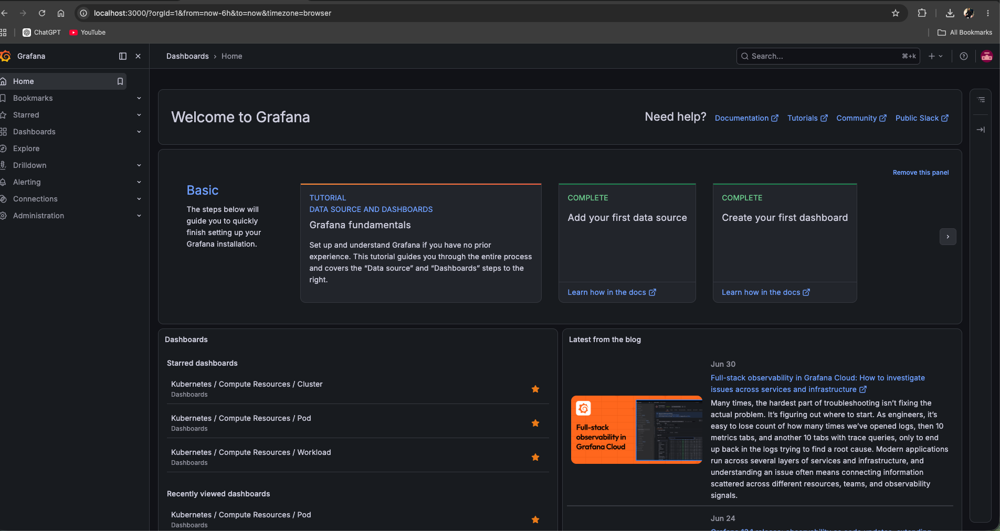
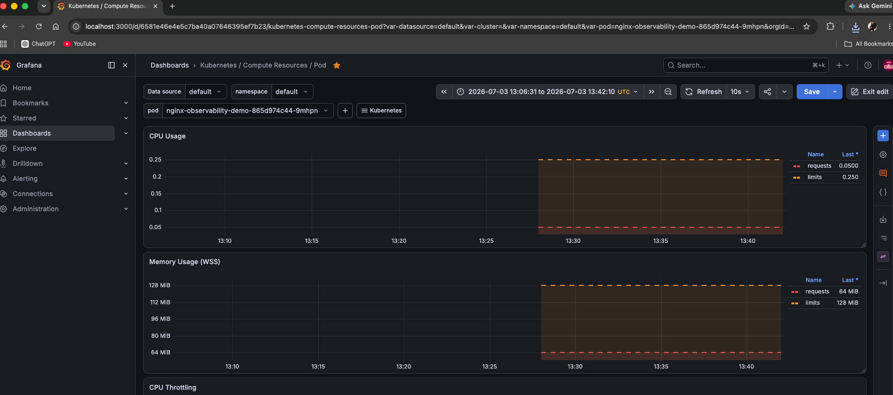

# Kubernetes Observability Lab — Grafana & Prometheus

## Overview

This project is a beginner-friendly Kubernetes observability lab using **Grafana** and **Prometheus**.

The goal of this lab was to deploy a small Kubernetes workload, install a monitoring stack, visualize workload resource data, generate test traffic, and practice basic alert-style investigation in a support/SRE environment.

This lab was designed to demonstrate junior DevOps/SRE support skills, including Kubernetes basics, Helm usage, Grafana navigation, Prometheus queries, and basic troubleshooting documentation.

---

## Tools Used

- Kubernetes
- Minikube
- kubectl
- Helm
- Docker Desktop
- Prometheus
- Grafana
- kube-prometheus-stack
- NGINX
- PromQL

---

## Lab Objectives

- Create a local Kubernetes cluster using Minikube.
- Deploy an NGINX workload into Kubernetes.
- Expose the workload using a Kubernetes Service.
- Install Grafana and Prometheus using Helm.
- Access Grafana locally through port-forwarding.
- View Kubernetes workload dashboards in Grafana.
- Generate traffic using a temporary curl-based load generator.
- Query Prometheus metrics using Grafana Explore.
- Document basic support-style investigation steps.

---

## Project Structure

```text
kubernetes-observability-lab/
├── README.md
├── manifests/
│   ├── nginx-deployment.yaml
│   └── nginx-service.yaml
├── notes/
│   └── incident-investigation.md
└── screenshots/
    ├── grafana-home.png
    ├── kubernetes-workload-dashboard.png
    └── grafana-explore-load-generator-cpu.png
```

---

## Kubernetes Workload

The lab uses a simple NGINX deployment with two replicas.

The deployment includes basic CPU and memory requests and limits so the workload can be viewed clearly in Grafana dashboards.

```yaml
resources:
  requests:
    cpu: "50m"
    memory: "64Mi"
  limits:
    cpu: "250m"
    memory: "128Mi"
```

---

## Key Commands

### Start Minikube

```bash
minikube start --driver=docker
```

### Verify Kubernetes Cluster

```bash
kubectl get nodes
kubectl get pods
```

### Deploy NGINX Workload

```bash
kubectl apply -f manifests/nginx-deployment.yaml
kubectl apply -f manifests/nginx-service.yaml
```

### Install Prometheus and Grafana

```bash
helm repo add prometheus-community https://prometheus-community.github.io/helm-charts
helm repo update

kubectl create namespace monitoring

helm install monitoring prometheus-community/kube-prometheus-stack \
  --namespace monitoring
```

### Verify Monitoring Stack

```bash
kubectl get pods -n monitoring
```

### Access Grafana

```bash
kubectl get secret monitoring-grafana -n monitoring \
  -o jsonpath="{.data.admin-password}" | base64 --decode

kubectl port-forward svc/monitoring-grafana -n monitoring 3000:80
```

Grafana was accessed locally at:

```text
http://localhost:3000
```

---

## Load Generation

A temporary curl-based load generator was created to generate traffic against the NGINX service.

```bash
kubectl create deployment nginx-load-generator \
  --image=curlimages/curl \
  -- /bin/sh -c 'while true; do curl -s http://nginx-observability-demo.default.svc.cluster.local > /dev/null; done'
```

The deployment was scaled to create more visible activity:

```bash
kubectl scale deployment nginx-load-generator --replicas=3
```

After testing, the load generator was removed:

```bash
kubectl delete deployment nginx-load-generator
```

---

## Prometheus Query Used

Grafana Explore was used to query Prometheus directly.

```promql
sum(rate(container_cpu_usage_seconds_total{pod=~"nginx-load-generator.*"}[5m])) by (pod)
```

This query showed CPU activity from the load-generator pods and confirmed that Grafana could query Prometheus for Kubernetes container metrics.

---

## Screenshots

### Grafana Home



### Kubernetes Workload Dashboard



### Grafana Explore — Load Generator CPU


---

## Support-Style Investigation Summary

A temporary load generator was deployed to create measurable activity against the NGINX service.

Grafana dashboards were reviewed to confirm Kubernetes workload visibility, and Grafana Explore was used to run a Prometheus query against container CPU metrics. The load-generator pods showed increased CPU usage, confirming that Prometheus was collecting container metrics and Grafana was able to visualize them.

The investigation followed a basic support workflow:

1. Confirm the workload was running.
2. Generate controlled traffic.
3. Review Kubernetes dashboards in Grafana.
4. Query Prometheus directly using Grafana Explore.
5. Confirm live CPU activity from the load-generator pods.
6. Remove the temporary load generator after testing.

---

## What I Learned

- Helm can be used to install and manage Kubernetes applications through charts.
- kube-prometheus-stack provides a fast way to deploy Prometheus, Grafana, Alertmanager, and related monitoring components.
- Grafana dashboards can visualize Kubernetes workload, pod, CPU, memory, and quota information.
- Prometheus stores time-series metrics that can be queried using PromQL.
- Grafana Explore is useful when dashboards do not show the exact data needed.
- `kubectl top pods` and Prometheus/Grafana metrics are related but may come from different monitoring paths.
- Basic observability work includes verifying workloads, checking metrics, generating traffic, reviewing dashboards, and documenting findings.

---

## Cleanup

To stop the local Kubernetes cluster without deleting the lab setup:

```bash
minikube stop
```

To fully remove the monitoring stack:

```bash
helm uninstall monitoring -n monitoring
kubectl delete namespace monitoring
```

To delete the NGINX workload:

```bash
kubectl delete -f manifests/nginx-service.yaml
kubectl delete -f manifests/nginx-deployment.yaml
```